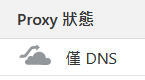
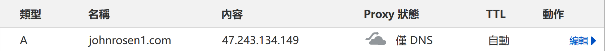
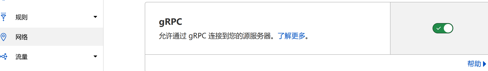
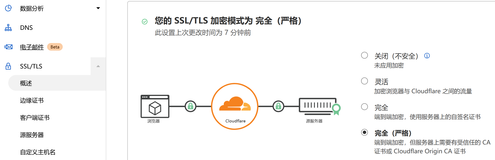

# 

[TG Channel](https://t.me/vpstoolbox) [简体中文](README.md)

Tired of always needing to manually enter commands to install blog, online drive, RSS, email, proxy? VPSToolBox provides a complete set of fully automated solutions, free your hands, starting today!

> After observation, **the problem of automatic certificate renewal has been solved**, the solution has been stable and can be used normally for a long time.

## One click command

```bash
apt-get update --fix-missing && apt-get upgrade -y && apt-get install sudo curl -y && curl -Ss https://raw.githubusercontent.com/johnrosen1/vpstoolbox/master/vps.sh | sudo bash
````

> Only supports **Debian/Ubuntu** systems.

## Preconditions and key points (Usage instruction)

1. **Trojan-GFW does not support Cloudflare CDN! ! ! ** (  )
2. Please run as **root(sudo -i)** (**overwrite installation**).


4. Please [buy](https://www.namesilo.com/?rid=685fb47qi)/[white prostitution](https://www.freenom.com)/ use your existing **domain name** and **[Complete DNS A resolution](https://dnschecker.org/)**, point the domain name to your VPS IP, (Namesilo takes 15+min to take effect at the slowest). 
5. Please **completely close or disable the VPS firewall (ie open all TCP + UDP ports) in the Server/VPS/Various Control Panel. **
> _Trojan-gfw and Shadowsocks-rust both support **Fullcone-nat** but need to open all ports on the server to use it. _
6. [HTTP application](https://github.com/acmesh-official/acme.sh/wiki/Blogs-and-tutorials) TLS certificate requires **domain name A resolution to take effect**, [API application](https: //github.com/acmesh-official/acme.sh/wiki/dnsapi) you need to enter the correct information. 
7. After installation, **BBR is enabled by default**, no manual configuration is required.
8. If you use gRPC to forward through Cloudflare, you need to allow gRPC in Cloudflare Control Panel -> Network.  

## Disclaimer

1. This project is not responsible for any possible problems caused by Vultr machines!
2. Some non-essential applications of this project require high system resources and server configuration (Rocket.chat and mailboxes, etc.), please do what you can!

## Supported software and applications

All applications support fully automated installation and configuration, ready to be used **out of the box**!

> The ones that are ticked are those that enable default installation, and the rest should be manually selected to install them. The category labels are for reference only (strike-through means that the application has been eliminated or has no actual value).

- Proxy
  - [x] [Trojan-gfw can customize the port, does not support Cloudflare CDN forwarding, no minimum configuration requirements](https://github.com/trojan-gfw/trojan)
  - [x] [Vless(grpc) customizable port, low latency, support Cloudflare CDN forwarding, no minimum configuration requirements](https://xtls.github.io/config/transports/grpc.html)
  - [ ] [Shadowsocks-rust is only recommended for use with IPLC/IEPL, does not support Cloudflare CDN forwarding, no minimum configuration requirements](https://github.com/shadowsocks/shadowsocks-rust)
- System
  - [x] [Acme.sh supports HTTP or DNS API to issue Let\'s encrypt certificate](https://github.com/acmesh-official/acme.sh)
  - [x] [IPv6 no requirements](https://en.wikipedia.org/wiki/IPv6)
  - [x] [Tcp-BBR and tcp_fastopen no requirements]
  - [x] [Netdata has no minimum configuration requirements](https://github.com/netdata/netdata)
- front end
  - [x] [Nginx has no minimum configuration requirements](https://github.com/nginx/nginx)
  - [x] [Hexo Blog no minimum configuration requirements](https://github.com/hexojs/hexo)
  - [ ] [Typecho has no minimum configuration requirements](https://typecho.org/)
- download
  - [ ] [Qbittorrent_enhanced_version High Storage Requirements](https://github.com/c0re100/qBittorrent-Enhanced-Edition)
  - [ ] [Aria2 High HDD Requirements](https://github.com/aria2/aria2)
  - [ ] [AriaNG is only used as a front-end without minimum configuration requirements](https://github.com/mayswind/AriaNg/)
- netdisc
  - [ ] [Nextcloud High Storage Requirements](https://github.com/nextcloud/server)
  - [ ] [Rclone is only used as an API, no minimum configuration requirements](https://github.com/rclone/rclone)
  - [ ] [Filebrowser Storage Requirements](https://github.com/filebrowser/filebrowser)
  - [ ] [Onedrive High Network Demand](https://johnrosen1.com/2021/02/14/onedrive/)
- RSS
  - [ ] [RSSHub High Hard Disk Requirements](https://github.com/DIYgod/RSSHub)
  - [ ] [Miniflux has no minimum configuration requirements](https://miniflux.app/index.html)
        ~~- [ ] [Tiny Tiny RSS](https://git.tt-rss.org/fox/tt-rss)~~
- Video
  - [ ] [JellyFin High CPU Requirements](https://github.com/jellyfin/jellyfin)
- Mail
  - [ ] [Mail Service High Memory Requirements](https://johnrosen1.com/2020/08/27/mail1/)
- Communication
  - [ ] [RocketChat high memory requirement](https://github.com/RocketChat/Rocket.Chat)
- Bandwith
  - [ ] [Librespeed has no minimum configuration requirements](https://github.com/librespeed/speedtest)
- Security
  - [x] [Fail2ban has no minimum configuration requirements](https://github.com/fail2ban/fail2ban)
- Database
  - [ ] [MariaDB](https://github.com/MariaDB/server)
  - [ ] [Redis-server](https://github.com/redis/redis)
  - [ ] [MongoDB](https://github.com/mongodb/mongo)
- Darknet
  - [ ] [Tor](https://www.torproject.org/)
  ~~- [i2pd](https://github.com/PurpleI2P/i2pd)~~
- other
  - [ ] [Docker](https://www.docker.com/)
  - [ ] [Opentracker high network requirements](https://erdgeist.org/arts/software/opentracker/)
  - [ ] [Dnscrypt-proxy2](https://github.com/DNSCrypt/dnscrypt-proxy)
  - [ ] [Qbittorrent_origin_version High HDD Requirements](https://github.com/qbittorrent/qBittorrent)
  ~~- [ ] [stun-server](https://github.com/jselbie/stunserver)~~
- Blockchain
  - [ ] [Monero/XMR high Storage requirements](https://github.com/monero-project/monero-gui)

> Welcome to PR for more applications.

## Supported Linux distributions

> Checked means tested, guaranteed availability, unchecked means theoretically supports but not tested.

- [x] Debian11
- [x] Debian10
- [x] Debian9
- [ ] Debian8
- [x] Ubuntu 20.xx
- [x] Ubuntu 18.xx
- [ ] Ubuntu 16.xx
- [ ] Ubuntu 14.xx

## Possible errors and causes

1. Certificate issuance failed
> Possible reasons: (1) tcp 80/443, that is, the tcp http/https port is not open (2) The resolution of domain name A is not completed or the api information is entered incorrectly
2. Can't connect after restarting
> Possible reasons: (1) VPS manufacturer panel problem (uncommon) (2) It takes a long time to restart, please wait
3. A service got 404/502
> Possible reasons: (1) There is no check in the installation list (2) A service is offline (please give feedback in time)
4. Stuck during installation
> Possible reasons: (1) slow network or error (2) CPU or hard disk garbage causes a slow installation process
5. Can't connect after installation
> Possible reasons: (1) Client configuration error (2) Local network problem (3) A service is offline (please give feedback in time)

## Software not yet added/integrated/tested (To be done)

Cuckoo.

- Video

- [ ] [Jackett](https://github.com/Jackett/Jackett)
- [ ] [Radarr](https://github.com/Radarr/Radarr)
- [ ] [Lidarr](https://github.com/lidarr/Lidarr)
- [ ] [Sonarr](https://github.com/Sonarr/Sonarr)
- [ ] [Bazarr](https://github.com/morpheus65535/bazarr)
- [ ] [Music Unlock](https://github.com/unlock-music/unlock-music)
- [ ] [youtube-dl](https://github.com/ytdl-org/youtube-dl)

- front end

- [mikutap](https://github.com/akirarika/mikutap)

## Project implementation Program Language

Implemented using the `bash shell`.

## Contribution

1. **Fork** this project
2. **Clone** to your own machine
3. **Commit** modification
4. **Push** to your own fork
5. Submit **Pull request**
6. For PR requirements, please see [**PR requirements**](https://github.com/johnrosen1/vpstoolbox/tree/dev/install)

## Bug feedback and Feature request

- [x][Github Issue](https://github.com/johnrosen1/vpstoolbox/issues)
- [x] [TG Group](https://t.me/vpstoolbox_chat)

Note:

1. I have a high probability of not seeing other feedback methods.
2. Unless you have a reason to convince me or directly submit a PR, ** will not accept proxy software support requests** (such as wireguard and the like).
3. No matter what happens, please **be sure to attach the steps to reproduce the error, screenshots, OS release and other information**, otherwise I will not be able to provide any help.

## Code Quality

1. This project realizes **modularity**
2. This project, which I personally wrote from the beginning of learning bash, may have many unreasonable points, and it is not recommended to study it as a direct teaching material.

## Rclone and how to use the fully automatic upload script

**[Aria2+Rclone+Onedrive realizes fully automated download](https://johnrosen1.com/2021/02/14/onedrive/)**

## Mail Service Terms of Use

1. A non-mainland China VPS/server with **independent public network IPv4** and **25/143/443/465/587/993 and other TCP ports must be able to use normally**.
   > _Alibaba cloud, Google cloud platform, vultr and other manufacturers do not meet this requirement (of course, if you are willing to negotiate with them, it is none of my business.). _
2. The server/VPS must have greater than or equal to **2+GB RAM and 30+GB Storage**.
3. A paid domain name (recommended [Namesilo](https://www.namesilo.com/?rid=685fb47qi)), .com/.xyz/.moe and other suffixes do not matter.
4. Your server (VPS) must support **rDNS(PTR) record** (unless you want your mail to be listed as spam).
5. The ip of your server (VPS) must not be in various mail blacklists (otherwise all mails you send will be listed as spam).
6. This project does not support Postfixadmin, LDAP and other related functions.
7. The automatic junk removal function defaults to 30d to clean up junk mail, and 14d to delete it.

> Due to the particularity of the mailbox service, it is only recommended for those who need it (and are willing to toss).

## Debug related

1. This project mainly uses systemd+docker-compose to start the service.
2. If you are too lazy to write the specifics, check the running status with `systemctl`, and remember to give feedback if you have any problems.

## Flow diagram

> Too lazy to update, just for reference.


## cha rice aff

1. [Namesilo](https://www.namesilo.com/?rid=685fb47qi)
2. [Neko Neko Relay](https://relay.nekoneko.cloud?aff=2257)

## License

````
MIT License

Copyright (c) 2019-2022 johnrosen1

Permission is hereby granted, free of charge, to any person obtaining a copy
of this software and associated documentation files (the "Software"), to deal
in the Software without restriction, including without limitation the rights
to use, copy, modify, merge, publish, distribute, sublicense, and/or sell
copies of the Software, and to permit persons to whom the Software is
furnished to do so, subject to the following conditions:

The above copyright notice and this permission notice shall be included in all
copies or substantial portions of the Software.

THE SOFTWARE IS PROVIDED "AS IS", WITHOUT WARRANTY OF ANY KIND, EXPRESS OR
IMPLIED, INCLUDING BUT NOT LIMITED TO THE WARRANTIES OF MERCHANTABILITY,
FITNESS FOR A PARTICULAR PURPOSE AND NONINFRINGEMENT. IN NO EVENT SHALL THE
AUTHORS OR COPYRIGHT HOLDERS BE LIABLE FOR ANY CLAIM, DAMAGES OR OTHER
LIABILITY, WHETHER IN AN ACTION OF CONTRACT, TORT OR OTHERWISE, ARISING FROM,
OUT OF OR IN CONNECTION WITH THE SOFTWARE OR THE USE OR OTHER DEALINGS IN THE
SOFTWARE.
````

## If this project helped you, that would be great!!

[](https://starchart.cc/johnrosen1/vpstoolbox)

## Digression, just take a look

1. What was the original intention of this project?
   A: I started this project mainly because I was lazy.
2. How long did the project take to complete?
   A: There are thousands of hours in total, not counting the time spent on maintenance.
3. How much did the project cost?
   A: It doesn't cost much in terms of money.
4. What is the current status of this project?
   A: There are no new features worth adding. I can only maintain and maintain, and this project is not very popular.
5. What was the most time-consuming thing in developing this project?
   A: Query various documentation and various debugging jobs.
6. Is there a time when you want to give up?
   A: Some functions are really hard to do, and there are times when you don't care about them, but in the end, I persevered.
7. What was the biggest takeaway from developing this project?
   A: I personally think that the biggest gain is not to learn any awesome technology, but to learn various basic skills required for project development.
8. What is the most unfortunate thing?
   A: I think the most unfortunate thing is that I am basically the only one who develops it, and not many people help me.